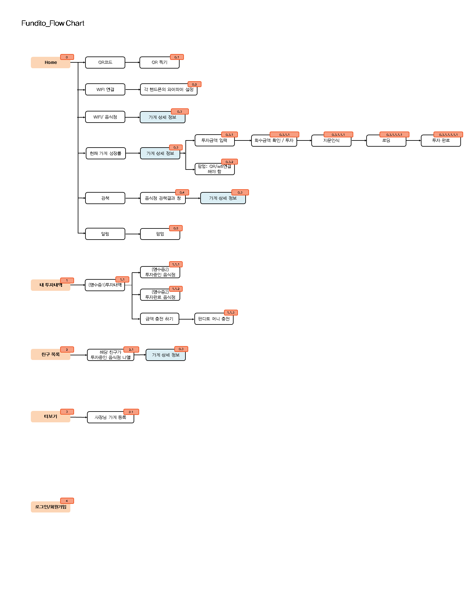
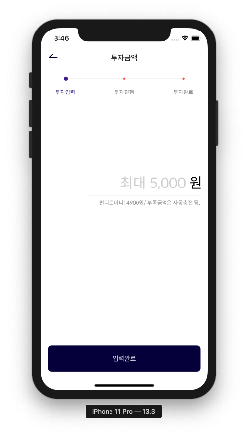
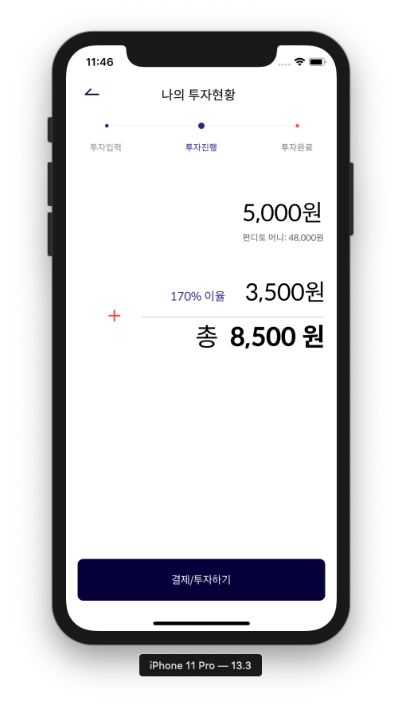
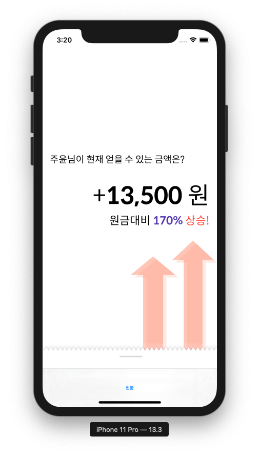
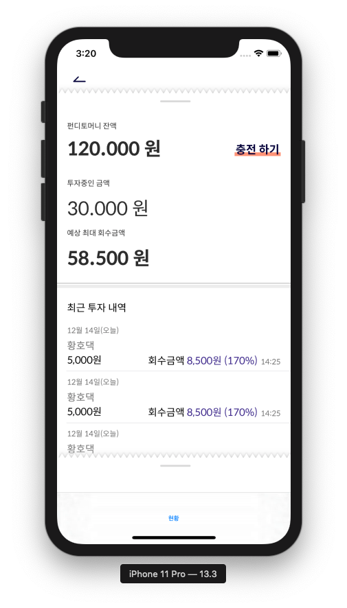

# Fundito-iOS
SOPT 25기 펀디토 iOS 저장소
*  나만의 맛집에 투자하는 외식업 크라우드 펀딩 서비스, 펀디토
> 

## 서비스 work flow

## 실행 화면 스크린 캡처

### 펀딩

### 현황

  
  

## 개발 환경 

### 개발 환경
> * Xcode 11.3
> * Swift 5.0.1

### 라이브러리
> * Alamofire
> * Kingfisher
> * FBSDKLoginKit

## 기능 소개 (기능 , 개발 여부, 기타 사항)

### 핵심 기능
|              기능             |     개발여부    |       비고       | 
|:----------------------------:|:-------------:|:--------------: |
| 홈 - 와이파이 정보 얻어오기 |       x       |                 |
| 홈 - 등록된 주변 가게 보여주기 |       x       |                 |
| 가게상세정보 |       x       |                 |
| 펀딩 |       △       |                 |
| 피드(친구) |       x       |                 |
| 현황 |       △       |                 | 거의 완료

### 부가 기능
|              기능             |     개발여부    |       비고       | 
|:----------------------------:|:-------------:|:--------------: |
| 검색 |       x       |                 |
| 페이스북 로그인 |       o       |                 |
| 상점/카드 등록 |       x       |                 |
| 가상계좌 충전 |       x       |                 |

## 문제점과 해결 방법 report (코드 첨부할 것)

1. 문제 1
> 밑에서 올라오는 중첩된 뷰 구현 필요
* 해결 방법 
> 1. VC에 UIView 추가
> 2. VC Class에 Outlet 으로 추가, extension으로 view를 설정해줄 함수(setupPopUpView) 정의
<pre>
@IBOutlet var firstPopUpView: FirstPopUpView!
// view의 크기와 위치를 설정
func setupPopUpView() {
        let frameFirst = CGRect(x: 0, y: 693, width: self.view.frame.width, height: 637)
        firstPopUpView.frame = frameFirst
        firstPopUpView.viewInit() // view의 클래스를 생성하여 필요한 초기 설정을 하는 함수
}
</pre>
> 3. 함수를 정의하여 view에 panGestureRecognizer를 추가하여 사용자가 끌어올릴 수 있도록 함
<pre>
func setupGestureRecognizer() {
        let pan = UIPanGestureRecognizer(target: self, action: #selector(handlePanGesture(_:)))
        pan.delegate = self
        self.firstPopUpView.addGestureRecognizer(pan)
    }
</pre>
> 4. handlePanGesture 함수를 정의하여 사용자의 손가락 움직임에 따른 분기 처리
<pre>
@objc func handlePanGesture(_ pan: UIPanGestureRecognizer) {
  let touchLocation = pan.location(in: self.view)
  let velocity = pan.velocity(in: self.view)
  
  switch pan.state {
  ...
  }
}
</pre>

