# Fundito-iOS
SOPT 25기 펀디토 iOS 저장소
>  나만의 맛집에 투자하는 외식업 크라우드 펀딩 서비스, 펀디토

## 서비스 work flow

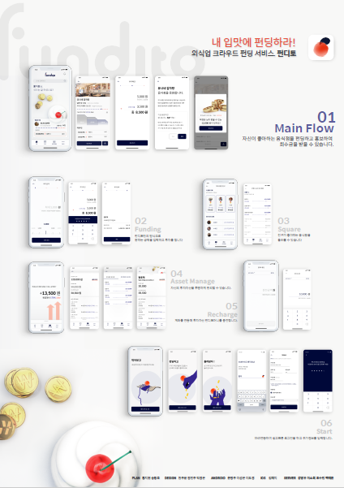

## 실행 화면 스크린 캡처

### 홈

  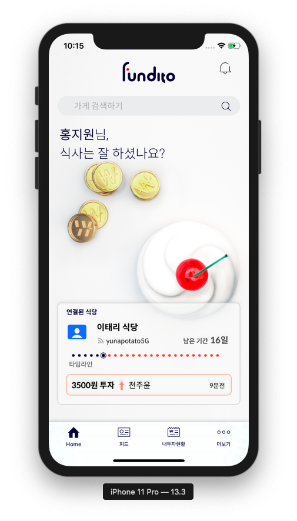
  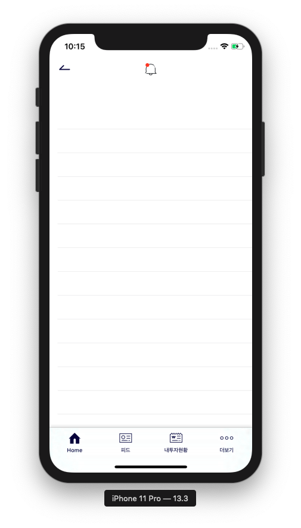

### 내투자현황

  
  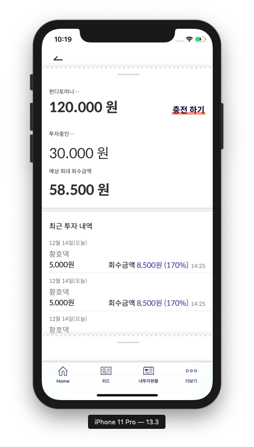
  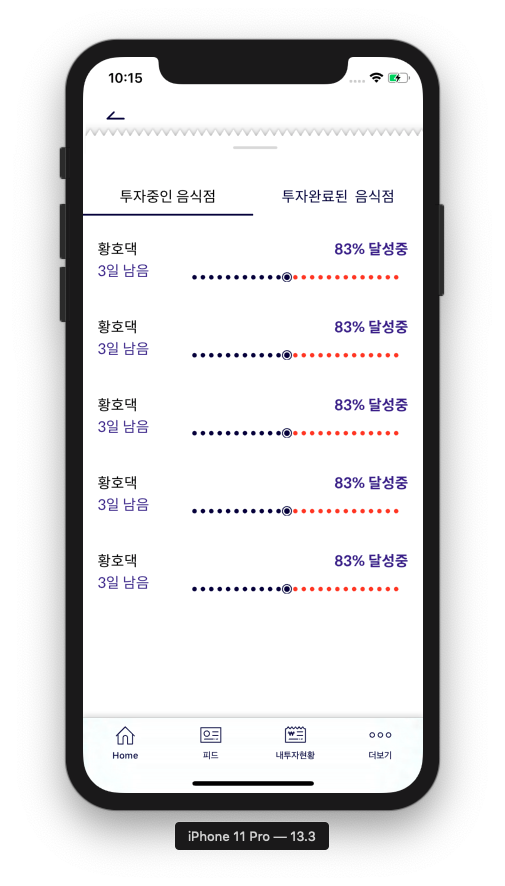
  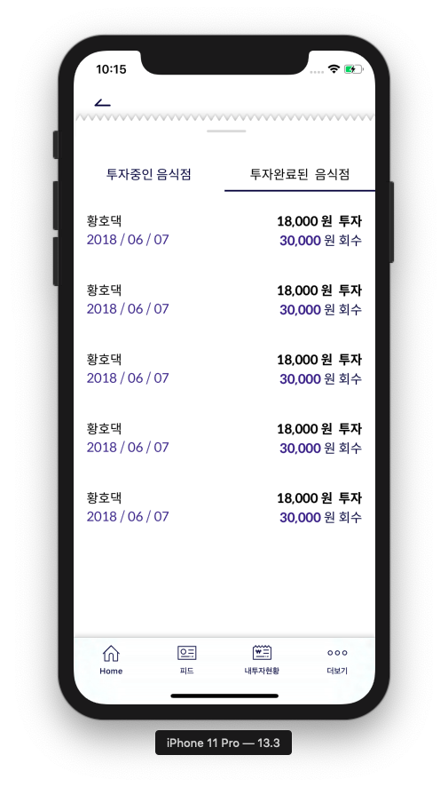
  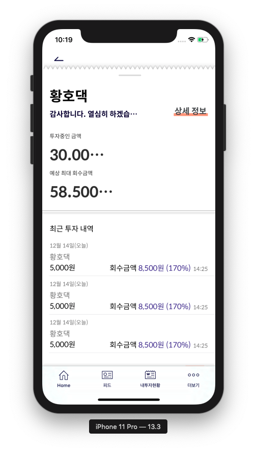

### 상점

  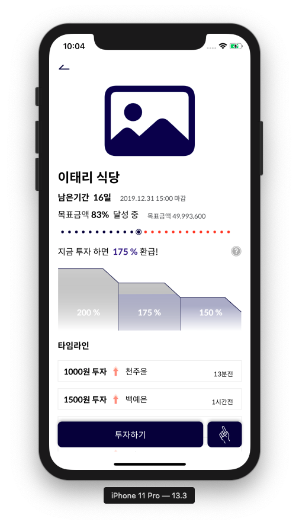
  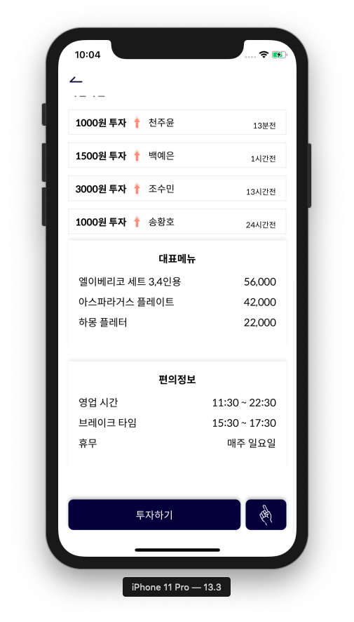
  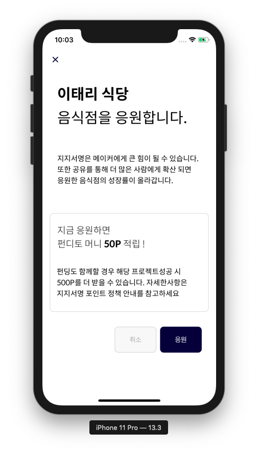

### 펀딩

  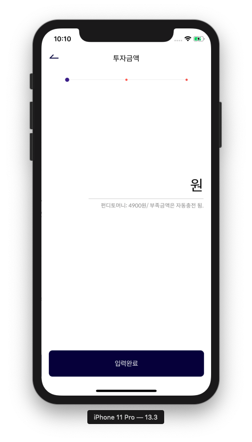
  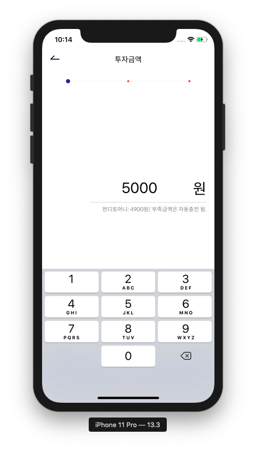
  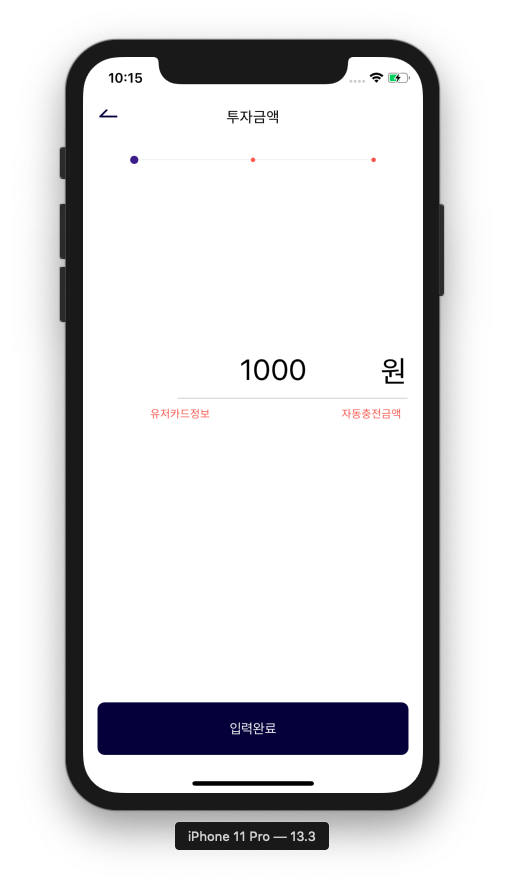
  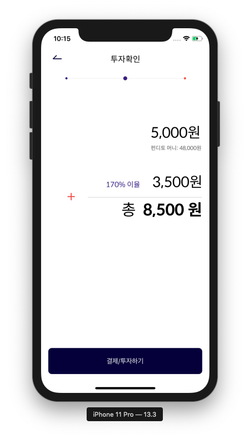  
  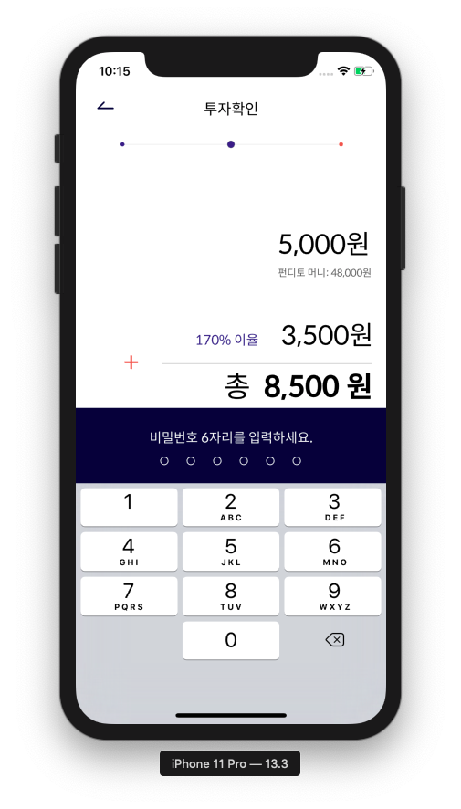  
  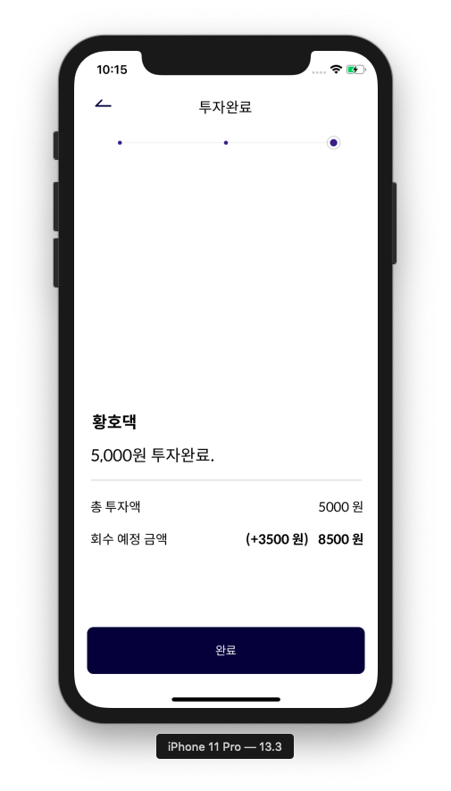

### 피드

  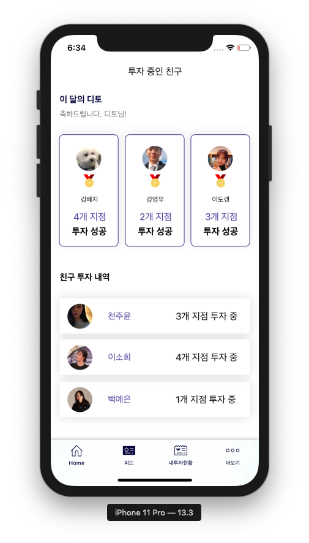

## 개발 환경 

### 개발 환경
> * Xcode 11.3
> * Swift 5.0.1

### 라이브러리
> * Alamofire
> * Kingfisher
> * FBSDKLoginKit

## 기능 소개 (기능 , 개발 여부, 기타 사항)

### 핵심 기능
|              기능             |     개발여부    |       비고       | 
|:----------------------------:|:-------------:|:--------------: |
| 홈 |       o       |                 |
| 가게상세정보 |       o       |                 |
| 펀딩 |       o       |                 |
| 피드(친구) |       x       |                 |
| 현황 |       o       |                 |

### 부가 기능
|              기능             |     개발여부    |       비고       | 
|:----------------------------:|:-------------:|:--------------: |
| 검색 |       x       |                 |
| 페이스북 로그인 |       o       |                 |
| 상점/카드 등록 |       x       |                 |
| 가상계좌 충전 |       x       |                 |

## 문제점과 해결 방법 report (코드 첨부할 것)

<h3> 문제 1 </h3>

> 밑에서 올라오는 중첩된 뷰 구현 필요

* 해결 방법 

> 1. VC에 UIView 추가
> 2. VC Class에 Outlet 으로 추가, extension으로 view를 설정해줄 함수(setupPopUpView) 정의

<pre>
@IBOutlet var firstPopUpView: FirstPopUpView!
// view의 크기와 위치를 설정
func setupPopUpView() {
        let frameFirst = CGRect(x: 0, y: 693, width: self.view.frame.width, height: 637)
        firstPopUpView.frame = frameFirst
        firstPopUpView.viewInit() // view의 클래스를 생성하여 필요한 초기 설정을 하는 함수
}
</pre>

> 3. 함수를 정의하여 view에 panGestureRecognizer를 추가하여 사용자가 끌어올릴 수 있도록 함

<pre>
func setupGestureRecognizer() {
        let pan = UIPanGestureRecognizer(target: self, action: #selector(handlePanGesture(_:)))
        pan.delegate = self
        self.firstPopUpView.addGestureRecognizer(pan)
    }
</pre>
> 4. handlePanGesture 함수를 정의하여 사용자의 손가락 움직임에 따른 분기 처리
<pre>
@objc func handlePanGesture(_ pan: UIPanGestureRecognizer) {
  let touchLocation = pan.location(in: self.view)
  let velocity = pan.velocity(in: self.view)
  
  switch pan.state {
  ...
  }
}
</pre>

<h3> 문제 2 </h3>

> 펀딩 - 6자리 비밀번호 입력 텍스트 필드 구현

* 해결 방법

> 1. 여섯 개의 텍스트 필드, 여섯 개의 뷰 생성. 
> * 텍스트 필드와 입력 값은 안보이게, 입력 전 상태에서 뷰는 하얀색 빈 동그라미로 설정
> * 텍스트 필드에 하나의 숫자가 입력되면, 바로 다음 텍스트 필드로 넘어가게 함

<pre>
func textFieldDidChangeSelection(_ textField: UITextField) {
        guard textFieldDidEditing else {
            textFieldDidEditing = true
            return
        }
        let isEmpty = textField.text?.isEmpty ?? false
        if textField == firstPwTextField {
            setPwViewBackground(view: firstPwView, isEmpty: isEmpty)
            if !isEmpty {
                secondPwTextField.becomeFirstResponder()
            }
        }
        if textField == secondPwTextField {
            setPwViewBackground(view: secondPwView, isEmpty: isEmpty)
            let _ = isEmpty ?
                firstPwTextField.becomeFirstResponder() :
                thirdPwTextField.becomeFirstResponder()
        }
        ...
}
</pre>

> 2. 입력한 값을 지우면 그 전 텍스트 필드로 넘어가야 함 
> * NotificationCenter

<pre>
NotificationCenter.default.addObserver(self, selector: #selector(handleDeleted), name: .init("deletePressed"), object: nil)
</pre>

<pre>
class PasswordTextField: UITextField {

  override func deleteBackward() {
    super.deleteBackward()
    NotificationCenter.default.post(name: .init("deletePressed"), object: nil)
  }
}
</pre>

<pre>
@objc func handleDeleted() {
        textFieldDidEditing = false
        if secondPwTextField.isFirstResponder {
            setPwViewBackground(view: firstPwView, isEmpty: true)
            firstPwTextField.becomeFirstResponder()
            firstPwTextField.text = ""
        }
</pre>

<h3> 문제 3 </h3>

> 내투자현황 - 두 번째 팝업 창에서 탭이 중간에 위치하고, 탭의 선택 여부에 따라 다른 뷰가 보여야 함

* 해결 방법
> 1.Fundito/Common/View/CustomTabView.siwft 에 커스텀 탭바 구현

> 2.선택되는 탭에 따라, 하나의 CollectionView에서 다른 cell이 나오도록 함

<pre>
func collectionView(_ collectionView: UICollectionView, cellForItemAt indexPath: IndexPath) -> UICollectionViewCell {
        if (customTabView.curIndex == 0){ //첫번째 탭 클릭했을때 customTabView.curIndex == 1
            let cell = collectionView.dequeueReusableCell(withReuseIdentifier: "TabCollectionViewCell", for: indexPath) as! TabCollectionViewCell
            return cell
        } else { //두번째 탭 클릭 customTabView.curIndex == 0
            let cell = collectionView.dequeueReusableCell(withReuseIdentifier: "Tab2CollectionViewCell", for: indexPath) as! Tab2CollectionViewCell
            return cell
        }
}
</pre>

## MVC foldering
* M : Fundito/Data/Model
* V : Fundito/Storyboard 
* C : Fundito/ViewController

## 팀원
* 김혜지
* (Helper) 문명주
